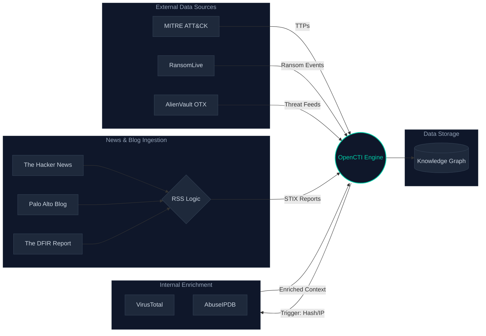

_:by Hannan Zainudin_
## 1. Introduction

Deploying **OpenCTI** fits naturally within a modern **DevSecOps approach to Cyber Threat Intelligence (CTI)** — where infrastructure, security, and data pipelines are treated as a single system.

This write-up documents a **real-world, end-to-end OpenCTI deployment** on a **secure Ubuntu Server**, aligned with common CTI environment build objectives such as:

- Secure Linux server administration
- Network and firewall configuration
- Containerized TIP deployment
- Search, queue, and cache backend integration

The guide walks through the journey from **initial VM preparation** to a **fully operational Threat Intelligence Platform (TIP)** enriched with external  import such as **MITRE ATT&CK, AlienVault OTX, and many trusted sources.

Rather than repeating official documentation, the focus is on:

- Applying secure installation principles
- Understanding how TIP components interact
- Avoiding common architectural and networking pitfalls

This makes the write-up suitable for both **technical learning milestones** and **internal operational documentation**.

---

## 2. Architecture Overview (Before Touching the Server)

Before installing anything, it is critical to understand that **OpenCTI is not a single application**. It is a distributed system running inside containers, coordinated by message queues and backed by a graph-heavy search engine.

![[Pasted image 20251223140711.png]]

### Core Components

- **OpenCTI Platform (Frontend + API)** – UI, GraphQL API, background workers
- **Elasticsearch / OpenSearch** – Stores entities, relationships, and indices
- **RabbitMQ** – Message broker between platform and connector
- **Redis** – Caching and job handling
- **MinIO** – Object storage (reports, files, attachments)
- **Connectors** – Data ingestion and enrichment engines

### Why This Matters

Most installation issues are **not configuration mistakes**, but **architecture misunderstandings**:

- Connectors communicate via RabbitMQ, not directly
- Elasticsearch performance determines UI responsiveness
- Network naming inside Docker is more important than IP addresses

Understanding this upfront prevents hours of blind troubleshooting later.

---

## 3. Preparing the Ubuntu Server (Environment Build)

### 3.1 System Requirements (Minimum Practical Setup)

| Component | Recommendation                  |
| --------- | ------------------------------- |
| CPU       | 4 vCPU                          |
| RAM       | 8 GB (4 GB works but not ideal) |
| Disk      | 100 GB HDD                      |
| OS        | Ubuntu Server 22.04 LTS         |
![[pic2.png]]
![[pic5.png]]
> Elasticsearch/OpenSearch is memory-hungry. Under-provisioning leads to instability.

### 3.2 Initial System Configuration
#### 3.2.1 Set a Static IP Address

Ubuntu Server uses **Netplan** for network configuration.

1. Identify the active network interface:

```bash
ip a
```

2. Edit the Netplan configuration file:

```bash
sudo nano /etc/netplan/50-cloud-init.yaml
```

3. Example static IP configuration:

```bash
network:
  version: 2
  renderer: networkd
  ethernets:
    ens33:
      dhcp4: no
      addresses:
        - 192.168.0.20/24
      routes:
        - to: default
          via: 192.168.0.2
      nameservers:
        addresses:
          - 1.1.1.1
          - 8.8.8.8
```
3. Apply the configuration:

```bash
sudo netplan apply
```

Validate connectivity before proceeding.

After VM creation:

- Set a **static IP address**
- Configure a meaningful **hostname**
- Ensure SSH access is available

These steps simplify connector communication and future troubleshooting.

---


#### 3.2.2 Configure a Meaningful Hostname

1. Set the hostname:

```bash
sudo hostnamectl set-hostname opencti-nazein
```

2. Update the hosts file:

```bash
sudo nano /etc/hosts
```

Example:
```bash
127.0.0.1 localhost
192.168.1.50 opencti-nazein
```

3. Verify:

```bash
hostnamectl
```

The hostname will now appear consistently in logs and prompts.
#### 3.2.3 Ensure SSH Access Is Available

SSH is the primary management method for a server-based TIP deployment.

1. Confirm SSH server is installed:

```bash
sudo apt install openssh-server -y
```

2. Verify SSH service status:

```bash
sudo systemctl status ssh
```

3. Test SSH access from another machine:

```bash
ssh user@192.168.0.200
```

Once confirmed, SSH hardening can be safely applied in the next section.
### 3.3 Post-Install Ubuntu Hardening

Before deploying the TIP, basic system hardening is applied.
#### 3.3.1 Non-Root Administrative Access

```bash
adduser opencti-nazein
usermod -aG sudo opencti-nazein
```

#### 3.3.2 SSH Hardening

- Disable root SSH login
- Enforce key-based authentication

```bash
sudo nano /etc/ssh/sshd_config
```

Apply:

- `PermitRootLogin no`
- `PasswordAuthentication no`

Restart SSH:

```bash
sudo systemctl restart ssh
```

---

#### 3.3.4 Firewall Configuration (UFW)

```bash
sudo ufw default deny incoming
sudo ufw default allow outgoing
sudo ufw allow ssh
sudo ufw allow 8080/tcp   # OpenCTI UI
sudo ufw enable
```

Firewall rules should only expose **required TIP services**.

---

#### 3.3.5 System Updates & Maintenance

```bash
sudo apt update && sudo apt upgrade -y
sudo apt install unattended-upgrades -y
```

This completes the **secure Linux environment build** phase.

---

#### 3.3.6 Secure SSH Access

Edit SSH configuration:

```bash
sudo nano /etc/ssh/sshd_config
```

Recommended changes:

- `PermitRootLogin no`
- `PasswordAuthentication no`
- `PubkeyAuthentication yes`

Restart SSH:

```bash
sudo systemctl restart ssh
```

> Ensure SSH key access works before disabling password authentication.

---

#### 3.3.7 Enable Firewall (UFW)

Allow only required ports:

```bash
sudo ufw default deny incoming
sudo ufw default allow outgoing
sudo ufw allow ssh
sudo ufw allow 8080/tcp   # OpenCTI UI
sudo ufw enable
```

If using a reverse proxy later, restrict direct access to OpenCTI.

---

#### 3.3.8 Automatic Security Updates

```bash
sudo apt install unattended-upgrades -y
sudo dpkg-reconfigure unattended-upgrades
```

This ensures critical patches are applied without manual intervention.

---

#### System-Level Hardening (Baseline)

Recommended but optional:

- Disable unused services
- Configure fail2ban for SSH
- Set correct timezone and NTP

These steps are intentionally minimal to avoid interfering with Docker networking.

> Elasticsearch/OpenSearch is memory-hungry. Under-provisioning leads to instability.
### 3.4 System Preparation

![[pic8.png]]

Update the system:
![[pic9.png]]

```bash
sudo apt update && sudo apt upgrade -y
```

Install basic utilities:

```bash
sudo apt install -y ca-certificates curl gnupg lsb-release unzip
```

---

## 4. Installing Docker & Docker Compose

OpenCTI is deployed using containers, making Docker a core dependency.
This approach aligns with **DevSecOps practices**, where:
- Services are isolated
- Dependencies are reproducible
- Updates and rollbacks are controlled
### 4.1 Docker Installation

![[pic10.png]]

```bash
curl -fsSL https://get.docker.com | sudo sh
sudo usermod -aG docker $USER
newgrp docker
```

Verify:
![[pic12.png]]

```bash
docker --version
```

### 4.2 Docker Compose Plugin

```bash
sudo apt install docker-compose-plugin -y
docker compose version
```

---

## 5. Deploying OpenCTI Platform

### 5.1 Directory Structure

![[pic13.png]]

```bash
/opt/opencti/
 ├── docker-compose.yml
 ├── .env
 └── connectors/
```

This structure keeps the platform clean and allows connectors to scale independently.

---

### 5.2 Environment Configuration (.env)

![[pic16.png]]

Key variables (simplified explanation):

- `OPENCTI_ADMIN_EMAIL`
- `OPENCTI_ADMIN_PASSWORD`
- `OPENCTI_TOKEN` → Used by connectors
- `MINIO_ROOT_USER / PASSWORD`
- `RABBITMQ_DEFAULT_USER / PASS`

> **Best practice**: Generate strong random values. Do not reuse passwords.

---

### 5.3 Docker Compose File

Use the **official OpenCTI docker-compose.yml** as baseline.
Link: https://github.com/OpenCTI-Platform/docker

Why?

- Correct service dependencies
- Version compatibility
- Maintained by OpenCTI team

---

### 5.4 Starting OpenCTI
![[pic15.png]]

```bash
docker compose pull
docker compose up -d
```

Monitor startup:

```bash
docker compose logs -f opencti
```

>Initial startup may take **5–10 minutes**, especially Elasticsearch.

---
## 6. First Access & Validation

Access OpenCTI:
![[pic22-OPENCTI.png]]

```
http://<server-ip>:8080
```

Validation checklist:

- UI loads successfully
- Admin login works
- No red error banners
- Background workers running
![[pic23-OPENCTI.png]]

---

## 7. Connector Strategy (Important Section)

![[Pasted image 20251223144852.png|700x417]]

![[Pasted image 20251223144835.png|700x280]]
##  **8. Performance Optimization**

### Docker Logging

Prevent disk exhaustion:

```json
{
  "log-driver": "json-file",
  "log-opts": {
    "max-size": "10m",
    "max-file": "3"
  }
}
```

### Elasticsearch Memory

```bash
ES_JAVA_OPTS="-Xms4g -Xmx4g"
```

---

## 9. Errors Worth Documenting (Lessons Learned)

This write-up intentionally includes **errors that reveal how OpenCTI actually works internally**.

### 12.1 OpenCTI Unreachable from Connectors (Connection Refused)

This issue typically appears as:

- Connectors stuck in `RUNNING`
- Logs showing `connection refused` to OpenCTI API

Root causes:

- Docker network isolation
- Incorrect service hostname (`opencti` vs IP)
- DNS resolution failure inside containers

Lesson learned:

> In Docker, **service name matters more than IP address**.

---

### 12.2 Docker DNS & Networking Issues

Symptoms:

- Containers cannot resolve external domains
- Connectors fail to fetch data

Resolution strategy:

- Explicit DNS configuration in Docker daemon
- Avoid mixing host DNS assumptions with container DNS

Architectural takeaway:

> Containers do not inherit host networking assumptions.

---

### 12.3 Performance Degradation During MITRE Ingestion

Observed behavior:

- High CPU usage
- UI becomes slow or unresponsive
- Elasticsearch memory pressure

Why it happens:

- MITRE ingestion is graph-heavy
- Initial relationship creation is expensive

Mitigation:

- Increase JVM heap
- Let ingestion complete without running other connectors
- Avoid restarting containers mid-ingestion

---
## 10. Security Best Practices

- Restrict OpenCTI to internal access
- Use reverse proxy with TLS
- Rotate API tokens
- Backup volumes regularly

---

## 11. Useful Resources

Official and community resources used throughout this deployment:

- OpenCTI Documentation: [https://docs.opencti.io](https://docs.opencti.io/)
- OpenCTI GitHub Repository: [https://github.com/OpenCTI-Platform/opencti](https://github.com/OpenCTI-Platform/opencti)
- OpenCTI Docker Deployment: [https://github.com/OpenCTI-Platform/docker](https://github.com/OpenCTI-Platform/docker)
- MITRE ATT&CK Framework: [https://attack.mitre.org](https://attack.mitre.org/)
- AlienVault OTX: [https://otx.alienvault.com](https://otx.alienvault.com/)
- MISP Project: [https://www.misp-project.org](https://www.misp-project.org/)

Additional reading recommended for deeper understanding:

- Docker Networking Concepts
- Elasticsearch JVM tuning guidelines
- OpenCTI connector lifecycle documentation

---

## 12. Conclusion

Deploying OpenCTI is not difficult — **deploying it correctly is the real challenge**.

Understanding the architecture, connector behavior, and performance impact transforms OpenCTI from a _demo platform_ into a **production-ready threat intelligence system**.

This write-up intentionally focuses on **clarity, reasoning, and long-term maintainability**, not just commands.

---

## TL;DR (For Busy Readers)

- OpenCTI is connector-driven; without connectors, it does nothing
- Separate connectors from the core platform for stability
- Always ingest **MITRE first**, then other sources
- Docker service names matter more than IPs
- Performance issues are expected during heavy ingestion — plan for them

---

_End of document_